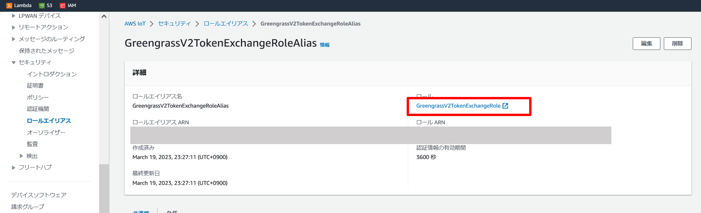
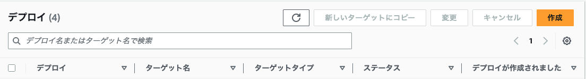

# people-counter-for-events

[Builders.Flash記事](https://xxx)

people-counter-for-events は AWS サービスを用いて、カメラで撮影した映像を ML で人物認識することでリアルタイムに人の入退場をカウントするシステムを構成するレポジトリです。このシステムをイベントブースに導入することで、ブース全体の総来場者数や、その中にある各展示毎に現在の人気度の把握や可視化することを目的にしています。

## アーキテクチャ


- 提供するコードは東京リージョン (ap-northeast-1) で動作するものとなっています。

 - エッジデバイス上にデプロイした AWS IoT Greengrass コンポーネントの ML アプリケーションにて、カメラで撮影した映像から人検知・人数カウント処理を行います。今回、映像をクラウド上ではなく、エッジデバイス上での処理にした理由は、リアルタイム性を重視したためです。映像をクラウドに送信する場合、大容量回線が必要となり、処理遅延も生じることになります。エッジデバイス上で映像を処理し、カウント結果だけを送信することで、帯域にとらわれず、リアルタイムでブラウザから確認することが可能になります。
 - カウント結果を Amazon Kinesis Data Streams、 AWS Lambda でリアルタイムに処理し、AWS AppSync の Mutation を使って、Amazon Dynamo DB にデータを保存します
 - カウント結果が更新される毎に、AWS AppSync の Subscription によってウェブアプリケーションが動的に値を取得し、ブラウザ上に表示します

## フロントエンド・バックエンドの設定

### a. フロントエンド・バックエンドの構築

今回使用頂くコードは、東京リージョン (ap-northeast-1) で動作するものとなっています。
まず、フロントエンド・バックエンドの構築のために、AWS Cloud9 を使用します。事前に [cloud9CloudFormation.yaml](people_count_front/setEnv/cloud9CloudFormation.yaml)をローカル環境にダウンロードしておきます。


AWS Cloud9 の環境を立ち上げるためにするために、AWS CloudFormation のスタックを作成します。テンプレートでの指定では、「テンプレートファイルのアップロード」 を選択し、先ほどダウンロードした cloud9CloudFormation.yaml をアップロードします。


任意のスタック名を入力し、その他の設定はデフォルトのままにして、スタックをデプロイします。
デプロイ完了後、AWS Cloud9 のコンソールに移動し、テンプレートによって作成された「WorkshopCloud9」環境に接続します。


AWS Cloud9 コンソールのターミナルから以下のコマンドを実行し、[GitHub](https://github.com/aws-samples/people-counter-for-events) からソースをクローンします。
AWS Cloud9 の操作についての詳細は、[本リンク](https://docs.aws.amazon.com/ja_jp/cloud9/latest/user-guide/tour-ide.html)をご覧ください。
```sh
cd /home/ec2-user/environment
git clone https://github.com/aws-samples/people-counter-for-events.git
```
AWS Cloud9 コンソールのターミナルから以下のコマンドを実行し、フロントエンド、バックエンド環境をデプロイします。
```sh
cd /home/ec2-user/environment/people-counter-for-events/people_count_back
 . development.sh
```

デプロイが完了すると、フロントエンド環境と下記のバックエンド環境が構築されていることを確認できます。

| AWSサービス名               | 名前                       |
| ---------------------------- | ------------------------------ |
| AWS AppSync | people_count_appsync|
| AWS Lambda 関数 | people_count_function |
| Amazon Kinesis Streams | people_count_stream |
| Amazon DynamoDB テーブル | videostream |

AWS AppSync の認証情報を設定するため、/home/ec2-user/environment/people-counter-for-events/people_count_front/src/aws-exports.jsを以下のように編集します。

```
const awsmobile = {
    aws_appsync_graphqlEndpoint: "<AWS AppSync の API URL>",
    aws_appsync_region: "ap-northeast-1",
    aws_appsync_authenticationType: "API_KEY",
    aws_appsync_apiKey: "<AWS AppSync の API KEY>",
};

export default awsmobile;
```

#### AWS AppSync のAPI URL 、API KEY の確認方法
AWS コンソールから AWS AppSync を検索し、AWS AppSync のサービス画面に遷移します。


API の項目から、「samples_appsync」を選択し、設定をクリックします。
以下項目の内容を控えておきます。
- API URL
- API KEY


上記 API URL、API KEY の値をそれぞれ aws_appsync_graphqlEndpoint、aws_appsync_apiKey に貼り付けてください。


以下のコマンドでフロント UI を立ち上げます。
```sh
cd /home/ec2-user/environment/people-counter-for-events/people_count_front
npm run serve
```

正常的に起動されたら Cloud9 の上段にある「Preview」ボタンをクリックし UI を開きます。
> NOTE:
> 今回のハンズオンでは、 AWS Cloud9 を使用しましたが、ローカル環境での動作も可能です。


「総来場者数」には検知エリアに入場した合計人数、「現在の来場者数」には検知エリア内の現在人数が表示されます。この後の手順でカメラ映像から人検知を行い、その結果がリアルタイムに反映されることを確認いただきます。

フロントエンド・バックエンドの設定はここまでの手順で完了ですが、サービスの設定内容について少しご紹介します。

### b. AWS AppSync の動作について

AWS AppSync での処理についてご説明します。
まず、 AWS Lambda から AWS AppSync にデータを送信すると、updatevideostream の Mutation リゾルバが実行されます。処理の内容としては、「current_count」及び「total_count」の値をインクリメントし、「camera_timestamp」及び「 update_timestamp」の値を最新の時間に更新しています。
```
{
    "version": "2017-02-28",
    "operation": "UpdateItem",
    "key": {
      "video_stream_id": { "S": $util.toJson($ctx.args.input.video_stream_id)},
    },
    "update" : { 
      "expression" : "ADD current_count :current_val, total_count :total_val SET camera_timestamp = :camera_timestamp, update_timestamp =:update_timestamp",
      "expressionValues" : {
          ":current_val" : { "N" :  $util.toJson($ctx.args.input.current_count) },
          ":total_val" : { "N" :  $util.toJson($ctx.args.input.total_count) }, 
          ":camera_timestamp": { "S" : $util.toJson($ctx.args.input.camera_timestamp)},
          ":update_timestamp": { "S" : $util.toJson($ctx.args.input.update_timestamp)},
      }
  }
  }
```
Mutation が実行されると  Subscription が動作し、データを取得します。 Mutation と異なり、リゾルバを作成しておく必要はなく、スキーマの設定をもとにサブスクライブされます。今回は、このサブスクライブ内容をフロントエンドで受け取ることで、 Amazon DynamoDB に直接クエリする必要なく最新データを取得することが可能になっています。
```
type Subscription {
      :
    （省略）
      :
    onUpdatevideostream(
        current_count: Int,
        total_count: Int,
        camera_timestamp: String,
        update_timestamp: String,
        video_stream_id: String
    ): videostream
        @aws_subscribe(mutations: ["updatevideostream"])
}
```

フロントエンドから最初に Amazon DynamoDB に格納されているアイテムのデータを取得する必要があるため、getvideostream に Query リゾルバも作成しています。プライマリキーを指定して Query を実行することでデータを取得することができます。
```
{
    "version" : "2017-02-28", 
    "operation" : "GetItem", 
    "key" : { 
        "video_stream_id" : $util.dynamodb.toDynamoDBJson($ctx.args.video_stream_id) 
        }, 

}
```

## AWS IoT Greengrass の設定

### a. AWS IoT Greengrass の設定

ローカル環境に [people_count](people_count/) 配下のソースをすべて、任意のディレクトリにダウンロードします。

今回の手順では、AWS IoT Greengrass を Windows マシンにインストールして、映像データの処理を行います。まず、[本リンク](https://aws.amazon.com/jp/blogs/news/aws-iot-greengrass-now-supports-the-windows-operating-system/)のステップ 7 まで実施してください。AWS IoT Greengrass のインストールが完了後、Windows のサービスから AWS IoT Greengrass が実行されていることを確認します。


AWS IoT Greengrass のコアデバイスに必要な IAM ポリシーをアタッチします。
AWS IoT のコンソール画面から [セキュリティ]→[ロールエイリアス]→[GreengrassV2TokenExchangeRoleAlias] を選択します。IAM ロール「GreengrassV2TokenExchangeRole」をクリックします。



IAM ロール「GreengrassV2TokenExchangeRole」に、以下の IAM ポリシーをアタッチします。

- AmazonKinesisFullAccess
- AmazonS3FullAccess

### b. AWS IoT Greengrass の設定

#### Python のインストール

Python の公式サイトから、Windows 向けの [Python 3.10.10](https://www.python.org/downloads/windows/) をインストールします。
[Customize installation] を選択します。
> NOTE: 
> Add python.exe to PATH が、チェックされていることを確認します。


「a. AWS IoT Greengrass の設定」で作成したユーザー「ggc_user」 が Python を扱えるようにするため、インストール時には [Install Python 3.10 for all users] と [Add Python on environment variables] にチェックを入れ、全ユーザをインストール対象にしてください。
インストール先のパスとして C:\Program Files\Python310 を指定します。
> NOTE: 
> ここからの手順では、上記パスに Python 3.10 系がインストールされていることを前提とします。


#### ライブラリのインストール

[Visual Studio Community 2022](https://visualstudio.microsoft.com/ja/vs/community/) をインストールし、「C++によるデスクトップ開発」をインストールします。これは、後ほどインストールする ”dlib“ のコンパイルで使用します。


PowerShell を、[管理者として実行する] を選択して開きます。
> NOTE:  
> PowerShell でのすべての作業は、管理者ユーザで実行してください。本作業により C:\Program Files\Python310\ 配下に、ライブラリがインストールされます


pip コマンドで、cmake をインストールします。
```sh
pip install cmake==3.26.1
```

cmake の インストール先が、C:\Program Files\Python310\Lib\site-packages 配下になっていることを確認します。
```sh
pip show cmake 
```


AWS IoT Greengrasss のコンポーネントを作成するために、 GDK CLI (AWS IoT Greengrass Development Kit Command-Line Interface) をインストールします。インストール方法は、[本URL](https://docs.aws.amazon.com/ja_jp/greengrass/v2/developerguide/greengrass-development-kit-cli.html) を参照してください。

people_count をクローンしたフォルダへ移動し、 pip を使って requirements_dev.txt 内の必要なライブラリをインストールします (requirements.txt とは異なるため注意してください)。requirements_dev.txt では、動作確認のため GUI での表示が可能なライブラリをインストールします。以下の例では Desktop フォルダ配下に people_count をダウンロードした想定で進めています。

```sh
cd ~/Desktop/people_count
pip install -r .\requirements_dev.txt
```
> NOTE:  
> requirements_dev.txt にある dlib は、インストール時に 10 分弱かかる場合があります。

### c. PeopleCount での Parameter の調整

#### Python プログラムの動作確認

まずは、動画ファイルで people_counter.py が起動することを確認します。
```sh
python .\people_counter.py -p models/ssd_mobilenet_v2_coco/output.pbtxt -m models/ssd_mobilenet_v2_coco/frozen_inference_graph.pb -t models/coco_label.txt -i videos/test.mp4 -g
```

以下のような画面が表示されれば正常に動作しています。PowerShell 上で Ctrl + C を押すことで、終了します。
次に、パソコン内蔵カメラ又は USB 接続カメラでも people_counter.py が正常動作することを確認します。-i 以降の記述を削除することで、パソコン内蔵カメラ又はUSB接続カメラからフレームを取得することができます。
```sh
python .\people_counter.py -p models/ssd_mobilenet_v2_coco/output.pbtxt -m models/ssd_mobilenet_v2_coco/frozen_inference_graph.pb -t models/coco_label.txt -g
```

#### 検知エリアの調整

次に検知エリアを設定します。エリアを指定するには先ほどの引数に、—area パラメータを追加します。
座標系は以下の画像のようになっています。対象となるエリアを {左端のx座標 (x1)},{上端のy座標 (y1)},{右端のx座標 (x2)},{下端のy座標 (y2)}という形式で指定します。(例: 0,0,100,100)


では、エリアを指定して people_counter.py を起動しましょう。以下のようなコマンドになります。
```sh
python .\people_counter.py -p models/ssd_mobilenet_v2_coco/output.pbtxt -m models/ssd_mobilenet_v2_coco/frozen_inference_graph.pb -t models/coco_label.txt -i videos/test.mp4 -g --area 200,200,700,400
```
GUI 画面を見ながら、青色の枠が所定の位置にくるよう、area として指定する座標を調整してください。
調整完了後の座標値はメモしておいてください。後ほど、 AWS IoT Greengrass コンポーネントの作成に利用します。

#### Greengrass デプロイ用設定の変更

テキストエディタで recipe.yaml を開き、18行目の Run コマンドを編集します。
--area 以降の数値を先ほど調査した値に変更します。また、送信先の Amazon Kinesis Streams 名を指定するため、—stream people_count_stream という引数を追加します。AWS Lambda での集計処理のため、--vsid 0 を指定します。
編集後は以下のようになります。
```
Run: "python -u {artifacts:decompressedPath}/people_count/people_counter.py -p {artifacts:decompressedPath}/people_count/models/ssd_mobilenet_v2_coco/output.pbtxt -m {artifacts:decompressedPath}/people_count/models/ssd_mobilenet_v2_coco/frozen_inference_graph.pb -t {artifacts:decompressedPath}/people_count/models/coco_label.txt --stream people_count_stream --vsid 0 --area 200,200,700,400"
```
テキストエディタで gdk-config.json を開き、4 行目と 10 行目の内容を編集します。4 行目の＜Authorの名前＞と10 行目の＜S3 バケット名＞をそれぞれ任意の Author 名、S3 バケット名に書き換えます。S3 バケット名はユニークかつ、下記の命名規則に従う必要があります。 この処理によって、新たに S3 バケットが作成され、 AWS IoT Greengrass コンポーネントのアーティファクトが格納されます。
> NOTE: 
> S3 バケット名の命名規則
> - バケット名は 3 ～ 63 文字の長さで、小文字、数字、ピリオド、ダッシュのみを使用できます。
> - バケット名の各ラベルは、小文字または数字で始まっている必要があります。
> - バケット名では、アンダースコア、末尾のダッシュ、連続するピリオド、隣接するピリオドとダッシュは使用できません。

```
{
  "component": {
    "com.vizcounter.people-counter": {
      "author": "<Authorの名前>",
      "version": "NEXT_PATCH",
      "build": {
        "build_system": "zip"
      },
      "publish": {
        "bucket": "<S3バケット名>",
        "region": "ap-northeast-1"
      }
    }
  },
  "gdk_version": "1.0.0"/
}
```

### d. コンポーネント作成
gdk コマンドを使用して、AWS IoT Greengrass コンポーネントをビルドします。
> NOTE: 
> 事前に gdk が下記フォルダにインストールされ、 Path が通っていることを確認します。


```sh
gdk component build
```


ビルドが成功したら、コンポーネントをクラウドにパブリッシュします。
```sh
gdk component publish
```

コンポーネントが、AWS クラウド上に登録されていることを確認します。


### e. デプロイ準備

デプロイを作成します。
AWS IoT Core のコンソールの左側のメニューより 、[Greengrass デバイス] >[デプロイ]を選択します。
画面右上の「作成」をクリックします。


デプロイターゲットに、「a．AWS IoT Greengrass の設定」の手順で作成されたモノのグループを選択します。


マイコンポーネントから、先ほど作成したコンポーネント「com.aws.vizcounter.people-counter」を選択します。次に、パブリックコンポーネントとして、「aws.greengrass.StreamManager」と 「aws.greengrass.Cli」 を選択します。(リストに表示されない場合は、「選択したコンポーネントのみを表示」 の選択を外してください。)


ステップ ３、ステップ ４ はスキップし、[デプロイ] をクリックします。デプロイ後、デプロイのステータスが成功していることを確認してください。デプロイには 10 分ほど時間がかかる場合があります。


カメラで撮影された映像がリアルタイムで人検知され、その結果が AWS Cloud9 でデプロイした Web 画面に出力されます。


## よくある質問集

1. カメラが起動しない

    


1. dlib のインストールに失敗する

    Vsiual Studio Community 2022 で「C++によるデスクトップ開発」がインストールされてないか、cmake のインストール先が適切でない可能性があります。
    cmake のインストール先が dlib のインストール時に使用している python 配下になっていない場合、再度、管理者ユーザでPowershellを実行し、cmeke をインストールしなおしてください。本手順では、 cmake の インストール先は、C:\Program Files\Python310\Lib\site-packages 配下になっています。　

1. Kinesis にデータが送信されない

    IAM ロール「GreengrassV2TokenExchangeRole」に、以下の IAM ポリシーをアタッチされていることを確認してください。
   - AmazonKinesisFullAccess
　
1. ggc_user で python にパスが通っておらず component broken となる

    python のインストールパスが適切か確認してください。ggc_user が実行できるパスになっている必要があります。
    本手順では、C:\Program Files\Python310に python をインストールしています。

## リソースの削除

使ったリソースをそのままにしておくと、利用していなくとも S3 バケットなど、コストが継続的に掛かるサービスもあるため、不要になった場合は削除してください。
作成した AWS CloudFormation スタック 「people-count-stack」を削除することで、バックエンド環境が削除できます。その他 AWS Cloud9 の環境、S3 バケット 、AWS IoT Greengrass の削除も忘れず行いましょう。


## License

This library is licensed under the MIT-0 License. See the LICENSE file.