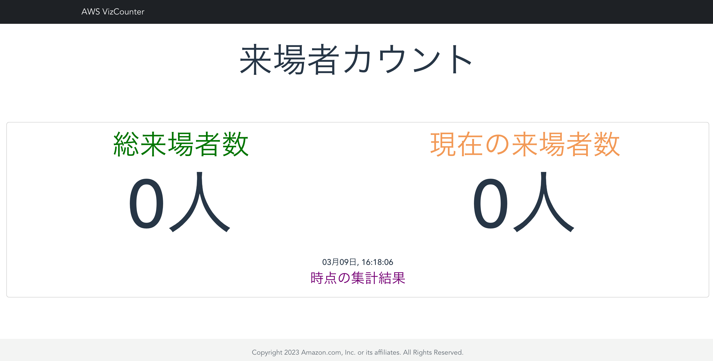

# people-counter-for-events

[Builders.Flash](https://xxx)

people-counter-for-events は AWS サービスを用いて、カメラで撮影した映像を ML で人物認識することでリアルタイムに人の入退場をカウントするシステムを構成するレポジトリです。このシステムをイベントブースに導入することで、ブース全体の総来場者数や、その中にある各展示毎に現在の人気度の把握や可視化することを目的にしています。

## アーキテクチャ


- 提供するコードは東京リージョン (ap-northeast-1) で動作するものとなっています。

 - エッジデバイス上にデプロイした AWS IoT Greengrass コンポーネントの ML アプリケーションにて、カメラで撮影した映像から人検知・人数カウント処理を行います。今回、映像をクラウド上ではなく、エッジデバイス上での処理にした理由は、リアルタイム性を重視したためです。映像をクラウドに送信する場合、大容量回線が必要となり、処理遅延も生じることになります。エッジデバイス上で映像を処理し、カウント結果だけを送信することで、帯域にとらわれず、リアルタイムでブラウザから確認することが可能になります。
 - カウント結果を Amazon Kinesis Data Streams、 AWS Lambda でリアルタイムに処理し、AWS AppSync の Mutation を使って、Amazon Dynamo DB にデータを保存します
 - カウント結果が更新される毎に、AWS AppSync の Subscription によってウェブアプリケーションが動的に値を取得し、ブラウザ上に表示します

## フロントエンド・バックエンドの設定

### a. フロントエンド・バックエンドの構築

今回使用頂くコードは、東京リージョン (ap-northeast-1) で動作するものとなっています。
まず、フロントエンド・バックエンドの構築のために、AWS Cloud9 を使用します。事前に [cloud9CloudFormation.yaml](people_count_front/setEnv/cloud9CloudFormation.yaml)をローカル環境にダウンロードしておきます。


AWS Cloud9 の環境を立ち上げるためにするために、AWS CloudFormation のスタックを作成します。テンプレートでの指定では、「テンプレートファイルのアップロード」 を選択し、先ほどダウンロードした cloud9CloudFormation.yaml をアップロードします。


任意のスタック名を入力し、その他の設定はデフォルトのままにして、スタックをデプロイします。
デプロイ完了後、AWS Cloud9 のコンソールに移動し、テンプレートによって作成された「WorkshopCloud9」環境に接続します。


AWS Cloud9 コンソールのターミナルから以下のコマンドを実行し、GitHub から[バックエンド用](people_count_back/)のソースをクローンします。
AWS Cloud9 の操作についての詳細は、[本リンク](https://docs.aws.amazon.com/ja_jp/cloud9/latest/user-guide/tour-ide.html)をご覧ください。
```sh
cd /home/ec2-user/environment
git clone https://github.com/aws-samples/people-counter-for-events.git
```
AWS Cloud9 コンソールのターミナルから以下のコマンドを実行し、フロントエンド、バックエンド環境をデプロイします。
```sh
cd /home/ec2-user/environment/people-counter-for-events/people_count_back
 . development.sh
```

デプロイが完了すると、フロントエンド環境と下記のバックエンド環境が構築されていることを確認できます。

| AWSサービス名               | 名前                       |
| ---------------------------- | ------------------------------ |
| AWS AppSync | people_count_appsync|
| AWS Lambda 関数 | people_count_function |
| Amazon Kinesis Streams | people_count_stream |
| Amazon DynamoDB テーブル | videostream |

AWS AppSync の認証情報を設定するため、/home/ec2-user/environment/people-counter-for-events/people_count_front/src/aws-exports.jsを以下のように編集します。

```
const awsmobile = {
    aws_appsync_graphqlEndpoint: "<AWS AppSync の API URL>",
    aws_appsync_region: "ap-northeast-1",
    aws_appsync_authenticationType: "API_KEY",
    aws_appsync_apiKey: "<AWS AppSync の API KEY>",
};

export default awsmobile;
```

#### AWS AppSync のAPI URL 、API KEY の確認方法
AWS コンソールから AWS AppSync を検索し、AWS AppSync のサービス画面に遷移します。


API の項目から、「samples_appsync」を選択し、設定をクリックします。
以下項目の内容を控えておきます。
- API URL
- API KEY


上記 API URL、API KEY の値をそれぞれ aws_appsync_graphqlEndpoint、aws_appsync_apiKey に貼り付けてください。


以下のコマンドでフロント UI を立ち上げます。
```sh
cd /home/ec2-user/environment/people-counter-for-events/people_count_front
npm run serve
```

正常的に起動されたら Cloud9 の上段にある「Preview」ボタンをクリックし UI を開きます。※今回のハンズオンでは、 AWS Cloud9 を使用しましたが、ローカル環境での動作も可能です。


「総来場者数」には検知エリアに入場した合計人数、「現在の来場者数」には検知エリア内の現在人数が表示されます。この後の手順でカメラ映像から人検知を行い、その結果がリアルタイムに反映されることを確認いただきます。

フロントエンド・バックエンドの設定はここまでの手順で完了ですが、サービスの設定内容について少しご紹介します。

### b. AWS AppSync の動作について

AWS AppSync での処理についてご説明します。
まず、 Amazon Lambda から AWS AppSync にデータを送信すると、updatevideostream の Mutation リゾルバが実行されます。処理の内容としては、「current_count」及び「total_count」の値をインクリメントし、「camera_timestamp」及び「 update_timestamp」の値を最新の時間に更新しています。
```
{
    "version": "2017-02-28",
    "operation": "UpdateItem",
    "key": {
      "video_stream_id": { "S": $util.toJson($ctx.args.input.video_stream_id)},
    },
    "update" : { 
      "expression" : "ADD current_count :current_val, total_count :total_val SET camera_timestamp = :camera_timestamp, update_timestamp =:update_timestamp",
      "expressionValues" : {
          ":current_val" : { "N" :  $util.toJson($ctx.args.input.current_count) },
          ":total_val" : { "N" :  $util.toJson($ctx.args.input.total_count) }, 
          ":camera_timestamp": { "S" : $util.toJson($ctx.args.input.camera_timestamp)},
          ":update_timestamp": { "S" : $util.toJson($ctx.args.input.update_timestamp)},
      }
  }
  }
```
Mutation が実行されると  Subscription が動作し、データを取得します。 Mutation と異なり、リゾルバを作成しておく必要はなく、スキーマの設定をもとにサブスクライブされます。今回は、このサブスクライブ内容をフロントエンドで受け取ることで、 Amazon DynamoDB に直接クエリする必要なく最新データを取得することが可能になっています。
```
type Subscription {
      :
    （省略）
      :
    onUpdatevideostream(
        current_count: Int,
        total_count: Int,
        camera_timestamp: String,
        update_timestamp: String,
        video_stream_id: String
    ): videostream
        @aws_subscribe(mutations: ["updatevideostream"])
}
```

フロントエンドから最初に AWS DynamoDB に格納されているアイテムのデータを取得する必要があるため、getvideostream に Query リゾルバも作成しています。プライマリキーを指定して Query を実行することでデータを取得することができます。
```
{
    "version" : "2017-02-28", 
    "operation" : "GetItem", 
    "key" : { 
        "video_stream_id" : $util.dynamodb.toDynamoDBJson($ctx.args.video_stream_id) 
        }, 

}
```
## License

This library is licensed under the MIT-0 License. See the LICENSE file.