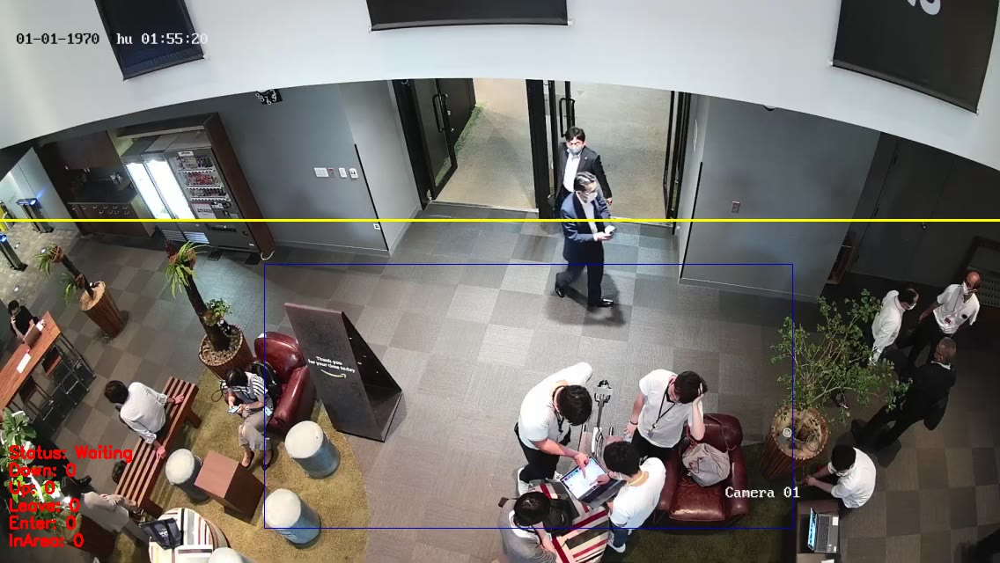

# People counter for events component
People counter for events Component works on AWS Greengrass v2. This program utilizes AI to detect people captured on camera, counting the number of individuals entering and exiting a designated area. With this capability, the software enables efficient and reliable headcounting, perfect for monitoring attendance at events like exhibitions and conferences.

People counter for events Component は AWS Greengrass v2 で動作する、AI物体検知用コンポーネントです。機械学習モデルを利用してカメラに映った人物を検出し、指定されたエリアに出入りする人の数をカウントし、クラウドへ送信します。これによって、展示会や会議などのイベントでの混雑状況を監視することが可能になります。

# How it works
AIモデルでの物体検知により、ある一定の範囲にいる人の数をカメラ映像からカウントする。継続的に検知を行い、領域から人が出たら-1, 入ったら+1することで全体の人数をカウントする。

# Usage


## Example: Line based counting
ラインを跨いだ人の数をカウントする
```
python people_counter.py -p models/ssd_mobilenet_v2_coco/output.pbtxt -m models/ssd_mobilenet_v2_coco/frozen_inference_graph.pb -t models/coco_label.txt -i videos/test.mp4 
```

## Example: Area based counting
一定領域を出入りした人の数をカウントする  
```
python people_counter.py -p models/ssd_mobilenet_v2_coco/output.pbtxt -m models/ssd_mobilenet_v2_coco/frozen_inference_graph.pb -t models/ssd_mobilenet_v2_coco/coco_label.txt -i videos/test.mp4 -s 500 --max_distance 100 --max_disappeared 80 --area 200,200,400,400
```

# Arguments
people_counter.py can be used both directly and as a greengrass component.

people_counter.pyは直接起動することもできますし、greengrassのコンポーネントとして使うこともできます。
起動時のオプションは次のとおりです。

オプション                                                    | 説明 (*付きのものは必須)                           
-------------------------------------------------------- | -----------------------------
-h, --help                                               | ヘルプメッセージを表示して終了する              
-p, --prototxt                         | * TensorFlowモデルのpbtxtファイルへのパス
-m, --model                                  | * TensorFlowモデルのfrozen graphへのパス            
-t, --label                               | * 検知対象とするオブジェクトのラベルファイルへのパス         
-i, --input                              | 入力ビデオファイルへのパス。ネットワークカメラの場合はRTSP URLを指定。未指定の場合はWebカメラ(device id=0)を使用          
-o, --output                           | ビデオファイルの出力先パス          
-c, --confidence                   | 弱い検出をフィルタリングするための最小確信度。デフォルトでは0.4。       
-s, --skip-frames                | MLモデルによる検出のインターバル時間（ミリ秒単位）  
-l, --line                                      | ラインベースでの検出を行う際のラインのy座標         
-a, --area                                     | 領域検知を行う際の対象領域（sx、sy、gx、gy）      
-g, --gui                                                | GUIで検知中の画像を表示する。gui対応のopencv-pythonが必要。                              
-vsid, --video_stream_id | ストリームに送信する際のビデオストリームID         
-stream, --stream                         | 送信先のストリーム名              
-tz , --timezone                        | UTCとローカルタイムゾーンとの差（デフォルトでは+9） 
--max_disappeared                         | 追跡の最大消失時間      
--max_distance  | 追跡の最大距離

# Trouble Shooting
よくある質問については[こちら](docs/faq.md)からどうぞ


